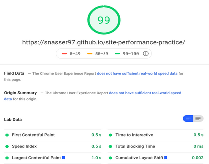
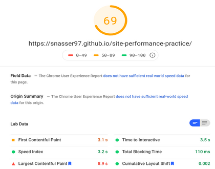

# Site performance practice

## [Audit/Test site here](https://snasser97.github.io/site-performance-practice/)
Exercise in improving a demo sites performance
  
<strong>Methods used:</strong>
<ul>
  <li>Minified + bundled JS vendor files</li>
  <li>MInified + bundled CSS vendor files</li>
  <li>Remove unused CSS</li>
  <li>Resize + serve hero image for large, med and small devices</li>
  <li>Preload fonts, css + vendors.js</li>
  <li>Defer js scripts - only execute once DOM content loaded</li>
  <li>Resize + compress images</li>
  <li>Create css sprite sheet for some icons - serve only 1 image for multiple icons
  </li>
</ul>

## pageSpeed Insights (before):
### Desktop

### Mobile

## webPageTest (before):

## pageSpeed Insights (before):
### Desktop

### Mobile

## webPageTest (after):

